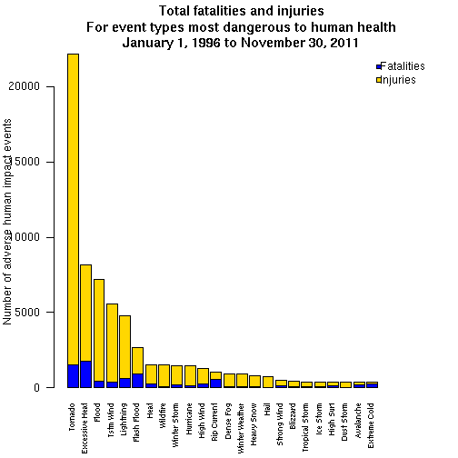
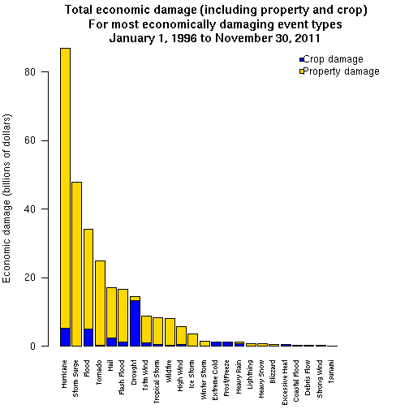

# Weather events most adversely impacting human health and economic activity in the United States

## *Heather Geiger- November 5, 2017*

### Synopsis

This document uses the NOAA (National Oceanic and Atomospheric Administration) Storm Database to summarize the weather events that have had the greatest impact on both human health (fatalities and injuries) and economic activity (crop and property damage) in the United States.

### Data Processing

First step - read in the data.


```r
storms <- read.csv("repdata-data-StormData.csv",header=TRUE,stringsAsFactors=FALSE,allowEscapes=TRUE)
```

Select only columns of interest from the data frame.

Then, show the first few lines (minus the "REMARKS" column which can be quite wide since it is free text).


```r
storms <- storms[,c("BGN_DATE", "STATE", "EVTYPE", "FATALITIES", "INJURIES", "PROPDMG", "PROPDMGEXP", "CROPDMG", "CROPDMGEXP", "REMARKS")]
head(storms[,setdiff(colnames(storms),"REMARKS")])
```

```
##             BGN_DATE STATE  EVTYPE FATALITIES INJURIES PROPDMG PROPDMGEXP
## 1  4/18/1950 0:00:00    AL TORNADO          0       15    25.0          K
## 2  4/18/1950 0:00:00    AL TORNADO          0        0     2.5          K
## 3  2/20/1951 0:00:00    AL TORNADO          0        2    25.0          K
## 4   6/8/1951 0:00:00    AL TORNADO          0        2     2.5          K
## 5 11/15/1951 0:00:00    AL TORNADO          0        2     2.5          K
## 6 11/15/1951 0:00:00    AL TORNADO          0        6     2.5          K
##   CROPDMG CROPDMGEXP
## 1       0           
## 2       0           
## 3       0           
## 4       0           
## 5       0           
## 6       0
```

Convert BGN_DATE to date format. Then, use this column to filter the data frame to include only events in or after 1996.

This is because according to the history of the database, the types of events recorded were fairly limited in the past.
See https://www.ncdc.noaa.gov/stormevents/versions.jsp.


```r
storms$BGN_DATE <- strptime(storms$BGN_DATE,format="%m/%d/%Y")
storms <- storms[which(storms$BGN_DATE >= "1996-01-01"),]
```

Filter out events with no impact to humans or property.


```r
storms <- storms[which(storms$FATALITIES > 0 | storms$INJURIES > 0 | storms$PROPDMG > 0 | storms$CROPDMG > 0),]
```

Now, we need to clean the data up a bit.

For one, we need to multiply the PROPDMG and CROPDMG columns by the appropriate numbers based on PROPDMGEXP and CROPDMGEXP.

Let's check the possible values in those columns.


```r
unique(c(storms$PROPDMGEXP,storms$CROPDMGEXP))
```

```
## [1] "K" ""  "M" "B"
```

Going to assume no exponent means keep the value as is, then K = 1,000, M = 1 million, and B = 1 billion.


```r
storms$PROPDMGEXP[which(storms$PROPDMGEXP == "")] <- 1
storms$PROPDMGEXP[which(storms$PROPDMGEXP == "K")] <- 1e3
storms$PROPDMGEXP[which(storms$PROPDMGEXP == "M")] <- 1e6
storms$PROPDMGEXP[which(storms$PROPDMGEXP == "B")] <- 1e9

storms$CROPDMGEXP[which(storms$CROPDMGEXP == "")] <- 1
storms$CROPDMGEXP[which(storms$CROPDMGEXP == "K")] <- 1e3
storms$CROPDMGEXP[which(storms$CROPDMGEXP == "M")] <- 1e6
storms$CROPDMGEXP[which(storms$CROPDMGEXP == "B")] <- 1e9
```

Let's reassign the PROPDMG and CROPDMG columns to be equal to PROPDMG times PROPDMGEXP and CROPDMG times CROPDMGEXP.
Then, exclude the PROPDMGEXP and CROPDMGEXP columns from the data frame.


```r
storms$PROPDMG <- storms$PROPDMG*as.numeric(storms$PROPDMGEXP)
storms$CROPDMG <- storms$CROPDMG*as.numeric(storms$CROPDMGEXP)

storms <- storms[,c("BGN_DATE", "STATE", "EVTYPE", "FATALITIES", "INJURIES", "PROPDMG","CROPDMG","REMARKS")]
```

Let's look at the distribution of each of our variables of interest.


```r
apply(storms[,c("FATALITIES", "INJURIES")],2,function(x)hist(x,plot=FALSE)[c("breaks","counts")])
```

```
## $FATALITIES
## $FATALITIES$breaks
##  [1]   0  10  20  30  40  50  60  70  80  90 100 110 120 130 140 150 160
## 
## $FATALITIES$counts
##  [1] 201249     45     12      4      5      0      0      1      0      1
## [11]      0      0      0      0      0      1
## 
## 
## $INJURIES
## $INJURIES$breaks
##  [1]    0   50  100  150  200  250  300  350  400  450  500  550  600  650
## [15]  700  750  800  850  900  950 1000 1050 1100 1150
## 
## $INJURIES$counts
##  [1] 201159     90     29     15      5      3      2      1      1      4
## [11]      2      1      0      1      1      3      0      0      0      0
## [21]      0      0      1
```

```r
apply(storms[,c("PROPDMG","CROPDMG")],2,function(x)hist(log10(x + 1),plot=FALSE,breaks=seq(from=0,to=12,by=1))[c("breaks","counts")])
```

```
## $PROPDMG
## $PROPDMG$breaks
##  [1]  0  1  2  3  4  5  6  7  8  9 10 11 12
## 
## $PROPDMG$counts
##  [1] 12050  1144  7924 79741 72426 20739  5898  1189   180    23     3
## [12]     1
## 
## 
## $CROPDMG
## $CROPDMG$breaks
##  [1]  0  1  2  3  4  5  6  7  8  9 10 11 12
## 
## $CROPDMG$counts
##  [1] 182627      1    136   6188   6945   3724   1286    344     66      1
## [11]      0      0
```

There are four events with PROPDMG > 10 billion and one event with CROPDMG > 1 billion. 

Let's just check these out in more detail and make sure they make sense.


```r
storms[which(storms$PROPDMG > 1e10 | storms$CROPDMG > 1e9),c("BGN_DATE", "STATE", "EVTYPE", "FATALITIES", "INJURIES", "PROPDMG","CROPDMG")]
```

```
##          BGN_DATE STATE            EVTYPE FATALITIES INJURIES   PROPDMG
## 577675 2005-08-28    LA HURRICANE/TYPHOON          0        0 1.693e+10
## 577676 2005-08-29    LA       STORM SURGE          0        0 3.130e+10
## 581535 2005-08-29    MS       STORM SURGE          0        0 1.126e+10
## 581537 2005-08-29    MS HURRICANE/TYPHOON         15      104 5.880e+09
## 605953 2006-01-01    CA             FLOOD          0        0 1.150e+11
##         CROPDMG
## 577675 0.00e+00
## 577676 0.00e+00
## 581535 0.00e+00
## 581537 1.51e+09
## 605953 3.25e+07
```

Looks like the other events with very large damage were around the time of Hurricane Katrina.

Let's check out the event that was not (the flood).


```r
storms[which(storms$PROPDMG > 1e11),]
```

```
##          BGN_DATE STATE EVTYPE FATALITIES INJURIES  PROPDMG  CROPDMG
## 605953 2006-01-01    CA  FLOOD          0        0 1.15e+11 32500000
##                                                                                                                                                                                                                                                                                                                                                                                               REMARKS
## 605953 Major flooding continued into the early hours of January 1st, before the Napa River finally fell below flood stage and the water receeded. Flooding was severe in Downtown Napa from the Napa Creek and the City and Parks Department was hit with $6 million in damage alone. The City of Napa had 600 homes with moderate damage, 150 damaged businesses with costs of at least $70 million.
```

Based on the description of the event, looks like that PROPDMG value may have been a typo.

Change to 115 million instead of billion.


```r
storms$PROPDMG[which(storms$PROPDMG > 1e11)] <- 115e6
```

Now, let's look at how many different event types there are.


```r
length(unique(storms$EVTYPE))
```

```
## [1] 222
```

Too many. We need to convert to the official 48 types.

Let's make a translation table with each type in the original list versus the type of the 48.

This requires some manual review.

I am going to use the manually selected translations as defined by Github developer pjpjean.

Available here: https://raw.githubusercontent.com/pjpjean/RepData_PeerAssessment2/master/evtypes-directive-10-1605.csv.


```r
original_list_evtypes <- unique(storms$EVTYPE)
original_list_evtypes <- original_list_evtypes[order(original_list_evtypes)]

originals_1_to_100 <- c("   HIGH SURF ADVISORY"," FLASH FLOOD"," TSTM WIND"," TSTM WIND (G45)","AGRICULTURAL FREEZE","ASTRONOMICAL HIGH TIDE","ASTRONOMICAL LOW TIDE","AVALANCHE","Beach Erosion","BLACK ICE","BLIZZARD","BLOWING DUST","blowing snow","BRUSH FIRE","COASTAL  FLOODING/EROSION","COASTAL EROSION","Coastal Flood","COASTAL FLOOD","Coastal Flooding","COASTAL FLOODING","COASTAL FLOODING/EROSION","Coastal Storm","COASTAL STORM","COASTALSTORM","Cold","COLD","COLD AND SNOW","Cold Temperature","COLD WEATHER","COLD/WIND CHILL","DAM BREAK","Damaging Freeze","DAMAGING FREEZE","DENSE FOG","DENSE SMOKE","DOWNBURST","DROUGHT","DROWNING","DRY MICROBURST","Dust Devil","DUST DEVIL","DUST STORM","Early Frost","Erosion/Cstl Flood","EXCESSIVE HEAT","EXCESSIVE SNOW","Extended Cold","Extreme Cold","EXTREME COLD","EXTREME COLD/WIND CHILL","EXTREME WINDCHILL","FALLING SNOW/ICE","FLASH FLOOD","FLASH FLOOD/FLOOD","FLOOD","FLOOD/FLASH/FLOOD","FOG","Freeze","FREEZE","Freezing drizzle","Freezing Drizzle","FREEZING DRIZZLE","FREEZING FOG","Freezing Rain","FREEZING RAIN","Freezing Spray","FROST","Frost/Freeze","FROST/FREEZE","FUNNEL CLOUD","Glaze","GLAZE","gradient wind","Gradient wind","GRADIENT WIND","GUSTY WIND","GUSTY WIND/HAIL","GUSTY WIND/HVY RAIN","Gusty wind/rain","Gusty winds","Gusty Winds","GUSTY WINDS","HAIL","HARD FREEZE","HAZARDOUS SURF","HEAT","Heat Wave","HEAVY RAIN","Heavy Rain/High Surf","HEAVY SEAS","HEAVY SNOW","Heavy snow shower","Heavy Surf","HEAVY SURF","Heavy surf and wind","HEAVY SURF/HIGH SURF","HIGH SEAS","High Surf","HIGH SURF","HIGH SWELLS")

originals_101plus <- c("HIGH WATER","HIGH WIND","HIGH WIND (G40)","HIGH WINDS","HURRICANE","Hurricane Edouard","HURRICANE/TYPHOON","HYPERTHERMIA/EXPOSURE","Hypothermia/Exposure","HYPOTHERMIA/EXPOSURE","Ice jam flood (minor","ICE ON ROAD","ICE ROADS","ICE STORM","ICY ROADS","Lake Effect Snow","LAKE EFFECT SNOW","LAKE-EFFECT SNOW","LAKESHORE FLOOD","LANDSLIDE","LANDSLIDES","Landslump","LANDSPOUT","LATE SEASON SNOW","LIGHT FREEZING RAIN","Light snow","Light Snow","LIGHT SNOW","Light Snowfall","LIGHTNING","Marine Accident","MARINE HAIL","MARINE HIGH WIND","MARINE STRONG WIND","MARINE THUNDERSTORM WIND","MARINE TSTM WIND","Microburst","MIXED PRECIP","Mixed Precipitation","MIXED PRECIPITATION","MUD SLIDE","Mudslide","MUDSLIDE","Mudslides","NON TSTM WIND","NON-SEVERE WIND DAMAGE","NON-TSTM WIND","Other","OTHER","RAIN","RAIN/SNOW","RECORD HEAT","RIP CURRENT","RIP CURRENTS","RIVER FLOOD","River Flooding","RIVER FLOODING","ROCK SLIDE","ROGUE WAVE","ROUGH SEAS","ROUGH SURF","SEICHE","SMALL HAIL","Snow","SNOW","SNOW AND ICE","SNOW SQUALL","Snow Squalls","SNOW SQUALLS","STORM SURGE","STORM SURGE/TIDE","Strong Wind","STRONG WIND","Strong Winds","STRONG WINDS","THUNDERSTORM","THUNDERSTORM WIND","THUNDERSTORM WIND (G40)","Tidal Flooding","TIDAL FLOODING","TORNADO","Torrential Rainfall","TROPICAL DEPRESSION","TROPICAL STORM","Tstm Wind","TSTM WIND","TSTM WIND  (G45)","TSTM WIND (41)","TSTM WIND (G35)","TSTM WIND (G40)","TSTM WIND (G45)","TSTM WIND 40","TSTM WIND 45","TSTM WIND AND LIGHTNING","TSTM WIND G45","TSTM WIND/HAIL","TSUNAMI","TYPHOON","Unseasonable Cold","UNSEASONABLY COLD","UNSEASONABLY WARM","UNSEASONAL RAIN","URBAN/SML STREAM FLD","VOLCANIC ASH","WARM WEATHER","WATERSPOUT","WET MICROBURST","Whirlwind","WHIRLWIND","WILD/FOREST FIRE","WILDFIRE","Wind","WIND","WIND AND WAVE","Wind Damage","WINDS","WINTER STORM","WINTER WEATHER","WINTER WEATHER MIX","WINTER WEATHER/MIX","Wintry Mix","WINTRY MIX")

translations_1_to_100 <- c("High Surf","Flash Flood","Thunderstorm Wind","Thunderstorm Wind","Frost/Freeze","Storm Surge/Tide","Astronomical Low Tide","Avalanche","Coastal Flood","Winter Weather","Blizzard","Dust Storm","Winter Storm","Wildfire","Coastal Flood","Coastal Flood","Coastal Flood","Coastal Flood","Coastal Flood","Coastal Flood","Coastal Flood","Tropical Storm","Tropical Storm","Tropical Storm","Cold/Wind Chill","Cold/Wind Chill","Cold/Wind Chill","Cold/Wind Chill","Cold/Wind Chill","Cold/Wind Chill","Flash Flood","Frost/Freeze","Frost/Freeze","Dense Fog","Dense Smoke","Thunderstorm Wind","Drought",NA,"Thunderstorm Wind","Dust Devil","Dust Devil","Dust Storm","Winter Weather","Coastal Flood","Excessive Heat","Heavy Snow","Extreme Cold/Wind Chill","Extreme Cold/Wind Chill","Extreme Cold/Wind Chill","Extreme Cold/Wind Chill","Extreme Cold/Wind Chill","Winter Weather","Flash Flood","Flash Flood","Flood","Flash Flood","Dense Fog","Frost/Freeze","Frost/Freeze","Frost/Freeze","Frost/Freeze","Frost/Freeze","Freezing Fog","Winter Weather","Winter Weather","Winter Weather","Frost/Freeze","Frost/Freeze","Frost/Freeze","Funnel Cloud","Winter Weather","Winter Weather","High Wind","High Wind","High Wind","Thunderstorm Wind","Thunderstorm Wind","Thunderstorm Wind","Thunderstorm Wind","Thunderstorm Wind","Thunderstorm Wind","Thunderstorm Wind","Hail","Frost/Freeze","High Surf","Heat","Heat","Heavy Rain","Heavy Rain","Marine High Wind","Heavy Snow","Heavy Snow","High Surf","High Surf","High Surf","High Surf","High Surf","High Surf","High Surf","High Surf")

translations_101plus <- c("High Surf","High Wind","High Wind","High Wind","Hurricane (Typhoon)","Hurricane (Typhoon)","Hurricane (Typhoon)","Heat","Cold/Wind Chill","Cold/Wind Chill","Flash Flood","Frost/Freeze","Frost/Freeze","Ice Storm","Frost/Freeze","Lake-Effect Snow","Lake-Effect Snow","Lake-Effect Snow","Lakeshore Flood","Debris Flow","Debris Flow","Debris Flow","Debris Flow","Winter Weather","Winter Weather","Winter Weather","Winter Weather","Winter Weather","Winter Weather","Lightning",NA,"Marine Hail","Marine High Wind","Marine Strong Wind","Marine Thunderstorm Wind","Marine Thunderstorm Wind","Thunderstorm Wind","Heavy Rain","Heavy Rain","Heavy Rain","Debris Flow","Debris Flow","Debris Flow","Debris Flow","Thunderstorm Wind","Thunderstorm Wind","Thunderstorm Wind",NA,NA,"Heavy Rain","Heavy Rain","Heat","Rip Current","Rip Current","Flood","Flood","Flood","Debris Flow","Storm Surge/Tide","Storm Surge/Tide","High Surf","Seiche","Hail","Winter Weather","Winter Weather","Winter Storm","Winter Weather","Winter Weather","Winter Weather","Storm Surge/Tide","Storm Surge/Tide","Strong Wind","Strong Wind","Strong Wind","Strong Wind","Thunderstorm Wind","Thunderstorm Wind","Thunderstorm Wind","Storm Surge/Tide","Storm Surge/Tide","Tornado","Heavy Rain","Tropical Depression","Tropical Storm","Thunderstorm Wind","Thunderstorm Wind","Thunderstorm Wind","Thunderstorm Wind","Thunderstorm Wind","Thunderstorm Wind","Thunderstorm Wind","Thunderstorm Wind","Thunderstorm Wind","Thunderstorm Wind","Thunderstorm Wind","Thunderstorm Wind","Tsunami","Hurricane (Typhoon)","Cold/Wind Chill","Cold/Wind Chill","Heat","Heavy Rain","Flash Flood","Volcanic Ash","Heat","Waterspout","Thunderstorm Wind","Thunderstorm Wind","Thunderstorm Wind","Wildfire","Wildfire","Strong Wind","Strong Wind","Strong Wind","Strong Wind","Strong Wind","Winter Storm","Winter Weather","Winter Weather","Winter Weather","Winter Weather","Winter Weather")

originals <- c(originals_1_to_100,originals_101plus)
translations <- c(translations_1_to_100,translations_101plus)

original_vs_translations <- data.frame(Original = originals,Translation = translations,stringsAsFactors=FALSE)
original_vs_translations <- original_vs_translations[match(original_list_evtypes,original_vs_translations$Original),]
```

Let's just check a few of the 48 event types and see which values from the original table they were matched with, to make sure the annotation makes sense.


```r
original_vs_translations[which(original_vs_translations$Translation == "Thunderstorm Wind"),]
```

```
##                    Original       Translation
## 36                DOWNBURST Thunderstorm Wind
## 39           DRY MICROBURST Thunderstorm Wind
## 76               GUSTY WIND Thunderstorm Wind
## 77          GUSTY WIND/HAIL Thunderstorm Wind
## 78      GUSTY WIND/HVY RAIN Thunderstorm Wind
## 79          Gusty wind/rain Thunderstorm Wind
## 80              Gusty winds Thunderstorm Wind
## 81              Gusty Winds Thunderstorm Wind
## 82              GUSTY WINDS Thunderstorm Wind
## 137              Microburst Thunderstorm Wind
## 146  NON-SEVERE WIND DAMAGE Thunderstorm Wind
## 145           NON TSTM WIND Thunderstorm Wind
## 147           NON-TSTM WIND Thunderstorm Wind
## 176            THUNDERSTORM Thunderstorm Wind
## 177       THUNDERSTORM WIND Thunderstorm Wind
## 178 THUNDERSTORM WIND (G40) Thunderstorm Wind
## 185               Tstm Wind Thunderstorm Wind
## 3                 TSTM WIND Thunderstorm Wind
## 186               TSTM WIND Thunderstorm Wind
## 192            TSTM WIND 40 Thunderstorm Wind
## 188          TSTM WIND (41) Thunderstorm Wind
## 193            TSTM WIND 45 Thunderstorm Wind
## 194 TSTM WIND AND LIGHTNING Thunderstorm Wind
## 189         TSTM WIND (G35) Thunderstorm Wind
## 190         TSTM WIND (G40) Thunderstorm Wind
## 4           TSTM WIND (G45) Thunderstorm Wind
## 195           TSTM WIND G45 Thunderstorm Wind
## 187        TSTM WIND  (G45) Thunderstorm Wind
## 191         TSTM WIND (G45) Thunderstorm Wind
## 196          TSTM WIND/HAIL Thunderstorm Wind
## 207          WET MICROBURST Thunderstorm Wind
## 208               Whirlwind Thunderstorm Wind
## 209               WHIRLWIND Thunderstorm Wind
```

```r
original_vs_translations$Original[which(original_vs_translations$Translation == "Winter Weather")]
```

```
##  [1] "BLACK ICE"           "Early Frost"         "FALLING SNOW/ICE"   
##  [4] "Freezing Rain"       "FREEZING RAIN"       "Freezing Spray"     
##  [7] "Glaze"               "GLAZE"               "LATE SEASON SNOW"   
## [10] "LIGHT FREEZING RAIN" "Light snow"          "Light Snow"         
## [13] "LIGHT SNOW"          "Light Snowfall"      "Snow"               
## [16] "SNOW"                "SNOW SQUALL"         "Snow Squalls"       
## [19] "SNOW SQUALLS"        "WINTER WEATHER"      "WINTER WEATHER MIX" 
## [22] "WINTER WEATHER/MIX"  "Wintry Mix"          "WINTRY MIX"
```

```r
original_vs_translations$Original[which(original_vs_translations$Translation == "High Surf")]
```

```
##  [1] "HAZARDOUS SURF"        "Heavy Surf"           
##  [3] "HEAVY SURF"            "Heavy surf and wind"  
##  [5] "HEAVY SURF/HIGH SURF"  "HIGH SEAS"            
##  [7] "High Surf"             "HIGH SURF"            
##  [9] "   HIGH SURF ADVISORY" "HIGH SWELLS"          
## [11] "HIGH WATER"            "ROUGH SURF"
```

Looks good!

Now, let's just reassign the event types in the table.


```r
for(i in 1:nrow(original_vs_translations))
{
evtype <- original_vs_translations$Original[i]
translation <- original_vs_translations$Translation[i]
storms$EVTYPE[which(storms$EVTYPE == evtype)] <- translation
}
```

The data set is now cleaned and ready to go.

Now let's get the sum of fatalities and injuries per event type.

Also get the sum of crop and property damage in a separate table.


```r
sum_fatalities_per_evtype <- aggregate(storms$FATALITIES,by=list(storms$EVTYPE),FUN=sum)
sum_injuries_per_evtype <- aggregate(storms$INJURIES,by=list(storms$EVTYPE),FUN=sum)

sum_fatalities_and_injuries_per_evtype <- data.frame(Fatalities = sum_fatalities_per_evtype$x,Injuries = sum_injuries_per_evtype$x,row.names=as.vector(sum_fatalities_per_evtype$Group.1),check.names=FALSE)

sum_property_damage_per_evtype <- aggregate(storms$PROPDMG,by=list(storms$EVTYPE),FUN=sum)
sum_crop_damage_per_evtype <- aggregate(storms$CROPDMG,by=list(storms$EVTYPE),FUN=sum)

sum_property_and_crop_damage_per_evtype <- data.frame(Crop.Damage = sum_crop_damage_per_evtype$x,Property.Damage = sum_property_damage_per_evtype$x,row.names=as.vector(sum_property_damage_per_evtype$Group.1),check.names=FALSE)
```

### Results

#### Across the United States, which weather events are most harmful with respect to human health?

We are going to only plot events where the total number of adverse human impacts (fatalities + injuries) is greater than or equal to the median.

Then, order by total fatalities + injuries in the plot.


```r
sum_fatalities_and_injuries_per_evtype <- sum_fatalities_and_injuries_per_evtype[which(sum_fatalities_and_injuries_per_evtype$Fatalities + sum_fatalities_and_injuries_per_evtype$Injuries >= median(sum_fatalities_and_injuries_per_evtype$Fatalities + sum_fatalities_and_injuries_per_evtype$Injuries)),]

sum_fatalities_and_injuries_per_evtype <- sum_fatalities_and_injuries_per_evtype[order(sum_fatalities_and_injuries_per_evtype$Fatalities + sum_fatalities_and_injuries_per_evtype$Injuries,decreasing=TRUE),]
```

Plot as a stacked barplot.


```r
#Transform (switch rows and columns).

sum_fatalities_and_injuries_per_evtype <- t(sum_fatalities_and_injuries_per_evtype)

#Change some of the column names to make them shorter and fit on plot better.

column_names <- colnames(sum_fatalities_and_injuries_per_evtype)
column_names[which(column_names == "Thunderstorm Wind")] <- "Tstm Wind"
column_names[grep('Hurricane',column_names)] <- "Hurricane"
column_names[grep('Extreme Cold',column_names)] <- "Extreme Cold"
column_names[which(column_names == "Cold/Wind Chill")] <- "Cold"

colnames(sum_fatalities_and_injuries_per_evtype) <- column_names

#Add 3 empty columns so there will be room for legend.

sum_fatalities_and_injuries_per_evtype <- cbind(sum_fatalities_and_injuries_per_evtype,matrix(NA,nrow=2,ncol=3))

#Ready to make plot.

barplot(sum_fatalities_and_injuries_per_evtype,col=c("blue","gold"),xlab="",ylab="Number of adverse human impact events",main="Total fatalities and injuries\nFor event types most dangerous to human health\nJanuary 1, 1996 to November 30, 2011",las=2,cex.names=0.7)
legend("topright",legend=c("Fatalities","Injuries"),pch=22,pt.bg=c("blue","gold"),bty="n",x.intersp=0.15)
```



Tornadoes and excessive heat are the most dangerous to human health, as defined by total associated fatalities and injuries during the time period studied.

#### Across the United States, which weather events are most harmful with respect to economic damage?

Again, plot only for certain events. Here we will require that total damage (regular property damage plus crop damage) is greater than or equal to the median.

Then, order by total damage in the plot.


```r
sum_property_and_crop_damage_per_evtype <- sum_property_and_crop_damage_per_evtype[which((sum_property_and_crop_damage_per_evtype$Crop.Damage + sum_property_and_crop_damage_per_evtype$Property.Damage) >= median(sum_property_and_crop_damage_per_evtype$Crop.Damage + sum_property_and_crop_damage_per_evtype$Property.Damage)),]

sum_property_and_crop_damage_per_evtype <- sum_property_and_crop_damage_per_evtype[order(sum_property_and_crop_damage_per_evtype$Crop.Damage + sum_property_and_crop_damage_per_evtype$Property.Damage,decreasing=TRUE),]

#Do same transformations and cleaning as for the fatalities and injuries plot.

sum_property_and_crop_damage_per_evtype <- t(sum_property_and_crop_damage_per_evtype)

column_names <- colnames(sum_property_and_crop_damage_per_evtype)
column_names[which(column_names == "Thunderstorm Wind")] <- "Tstm Wind"
column_names[grep('Hurricane',column_names)] <- "Hurricane"
column_names[grep('Extreme Cold',column_names)] <- "Extreme Cold"
column_names[which(column_names == "Cold/Wind Chill")] <- "Cold"
column_names[grep('Storm Surge',column_names)] <- "Storm Surge"

colnames(sum_property_and_crop_damage_per_evtype) <- column_names

sum_property_and_crop_damage_per_evtype <- cbind(sum_property_and_crop_damage_per_evtype,matrix(NA,nrow=2,ncol=3))

#Convert to billions.
sum_property_and_crop_damage_per_evtype <- sum_property_and_crop_damage_per_evtype/1e9

#Plot.

barplot(sum_property_and_crop_damage_per_evtype,col=c("blue","gold"),xlab="",ylab="Economic damage (billions of dollars)",main="Total economic damage (including property and crop)\nFor most economically damaging event types\nJanuary 1, 1996 to November 30, 2011",las=2,cex.names=0.7)
legend("topright",legend=c("Crop damage","Property damage"),pch=22,pt.bg=c("blue","gold"),bty="n",x.intersp=0.15)
```



Hurricanes are the most damaging economically, as defined by total economic damage in dollars.
